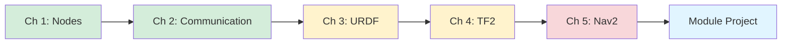

# Module 1: ROS 2 Fundamentals

Welcome to Module 1! Over the next 3 weeks, you'll master the **Robot Operating System 2 (ROS 2)**, the industry-standard middleware for building robot applications.

---

## Overview

**ROS 2** is a flexible framework for writing robot software. It provides services you'd expect from an operating system—hardware abstraction, low-level device control, message-passing between processes, and package management—but it's not actually an OS. ROS 2 runs on top of Ubuntu Linux (and other platforms) and provides the "glue" that connects sensors, actuators, planning algorithms, and control systems.

### Why ROS 2 (Not ROS 1)?

ROS 1 powered a decade of robotics research and industry applications, but it had limitations:
- Single-master architecture (not fault-tolerant)
- No native real-time support
- Limited security features
- Poor support for embedded systems

**ROS 2** (released 2017, LTS version "Humble" in 2022) addresses these issues:
- ✅ **Decentralized**: No single point of failure (uses DDS middleware)
- ✅ **Real-time capable**: Supports deterministic communication
- ✅ **Secure**: Built-in authentication and encryption (SROS2)
- ✅ **Multi-platform**: Works on Linux, Windows, macOS, embedded (QNX, VxWorks)
- ✅ **Production-ready**: Used by Tesla, Boston Dynamics, NASA JPL

**This book uses ROS 2 exclusively** (per ADR-001).

---

## Learning Outcomes

By the end of Module 1 (Weeks 1-3), you will be able to:

### LO-ROS2-001: Explain ROS 2 Architecture
- Describe nodes, topics, services, and actions
- Identify appropriate communication pattern for use cases
- Understand DDS middleware and Quality of Service (QoS)

### LO-ROS2-002: Implement Publisher/Subscriber Nodes
- Write Python nodes using `rclpy` API
- Publish messages to topics
- Subscribe to topics and process messages
- Use timers for periodic callbacks

### LO-ROS2-003: Create URDF Robot Descriptions
- Define robot links, joints, and visual/collision geometry
- Add sensors (cameras, LiDAR) to URDF
- Use `robot_state_publisher` to broadcast transforms
- Visualize robots in RViz

### LO-ROS2-004: Debug ROS 2 Applications
- Use CLI tools (`ros2 topic`, `ros2 node`, `ros2 service`)
- Inspect messages with `ros2 topic echo`
- Record and playback data with `ros2 bag`
- Troubleshoot common errors (namespace issues, QoS mismatches)

### LO-ROS2-005: Build Navigation Systems
- Set up Nav2 stack for autonomous navigation
- Configure path planning and obstacle avoidance
- Define navigation goals programmatically
- Integrate localization (AMCL) with mapping

---

## Prerequisites

Before starting Module 1, ensure you have:

### Technical Skills
- ✅ **Python proficiency**: Functions, classes, list comprehensions
- ✅ **Linux command line**: `cd`, `ls`, `apt install`, `source`
- ✅ **Git basics**: Cloning repositories, committing changes

### Software Installed
- ✅ **Ubuntu 22.04 LTS** (native or WSL 2)
- ✅ **ROS 2 Humble Desktop** (see [Prerequisites](/docs/prerequisites) for installation)
- ✅ **Python 3.10+**
- ✅ **Visual Studio Code** (recommended IDE)

### Hardware
- ✅ **Laptop/Desktop**: 16GB RAM, 4+ core CPU
- ✅ **Optional GPU**: Any GPU works for Module 1 (NVIDIA not required yet)

**Not ready?** → Review [Prerequisites](/docs/prerequisites) first

---

## Module Structure

Module 1 consists of **5 chapters** following our 7-part pedagogical structure (ADR-002):

### Chapter 1: ROS 2 Nodes & Architecture
- **Overview**: Introduction to ROS 2 compute graph
- **Theory**: Nodes, executors, middleware (DDS)
- **Lab**: Create your first ROS 2 node
- **Quiz**: 5 MCQ questions on architecture

**Estimated Time**: 3-4 hours

---

### Chapter 2: Topics, Services & Actions
- **Overview**: ROS 2 communication patterns
- **Theory**: Pub/sub topics, request/response services, long-running actions
- **Lab**: Build sensor data publisher/subscriber
- **Lab**: Create service for robot configuration
- **Quiz**: 5 MCQ questions + coding challenge

**Estimated Time**: 4-5 hours

---

### Chapter 3: URDF & Robot Description
- **Overview**: Unified Robot Description Format
- **Theory**: Links, joints, visual/collision meshes
- **Lab**: Write URDF for differential drive robot
- **Lab**: Add camera and LiDAR sensors
- **Quiz**: 5 MCQ questions on URDF syntax

**Estimated Time**: 3-4 hours

---

### Chapter 4: Coordinate Transforms (TF2)
- **Overview**: Managing coordinate frames
- **Theory**: Transformation trees, `robot_state_publisher`, `tf2_ros`
- **Lab**: Visualize transforms in RViz
- **Lab**: Broadcast dynamic transforms
- **Quiz**: 5 MCQ questions on TF2

**Estimated Time**: 3-4 hours

---

### Chapter 5: Autonomous Navigation (Nav2)
- **Overview**: Navigation stack for mobile robots
- **Theory**: Path planning (Dijkstra, A*), obstacle avoidance, localization (AMCL)
- **Lab**: Set up Nav2 in Gazebo
- **Lab**: Define navigation goals programmatically
- **Project**: Autonomous mobile robot (Module 1 capstone)
- **Quiz**: 5 MCQ questions + project assessment

**Estimated Time**: 6-8 hours

---

## Module Project: Autonomous Mobile Robot

**Goal**: Build a differential drive robot that autonomously navigates to waypoints in a simulated warehouse.

**Requirements**:
1. URDF robot description with LiDAR sensor
2. ROS 2 package with navigation nodes
3. Gazebo simulation environment with obstacles
4. Nav2 configured for path planning and obstacle avoidance
5. Video demo showing robot navigating to 3 waypoints

**Assessment Rubric**:
| Criterion | Points | Description |
|-----------|--------|-------------|
| **URDF Validity** | 15 | Robot loads in RViz/Gazebo without errors |
| **Navigation Success** | 40 | Robot reaches all 3 waypoints without collisions |
| **Code Quality** | 20 | Clean Python code, comments, error handling |
| **Obstacle Avoidance** | 15 | Robot successfully avoids dynamic obstacles |
| **Documentation** | 10 | README with setup and usage instructions |
| **Total** | **100** | |

**Deliverables**:
- GitHub repository with code
- 2-3 minute video demo
- README with setup instructions

---

## Chapter Roadmap

**Alt Text**: Flowchart showing Module 1 chapter progression: Nodes → Communication → URDF → TF2 → Nav2 → Module Project

**Caption**: Module 1 learning progression (green = beginner, yellow = intermediate, red = advanced, blue = project)

---

## Weekly Breakdown

### Week 1: ROS 2 Architecture & Nodes
**Topics**: Nodes, executors, command-line tools, workspaces
**Labs**: Install ROS 2, create basic nodes, debug with CLI
**Deliverable**: Working ROS 2 workspace with custom node
**Hours**: 10-12 hours

---

### Week 2: Communication Patterns
**Topics**: Topics (pub/sub), services (req/res), actions (goals/feedback)
**Labs**: Sensor data publisher, service implementation, action server
**Deliverable**: ROS 2 package with all 3 communication patterns
**Hours**: 11-12 hours

---

### Week 3: URDF, TF2 & Navigation
**Topics**: Robot descriptions, coordinate transforms, Nav2 stack
**Labs**: Write URDF, visualize in RViz, set up autonomous navigation
**Deliverable**: Autonomous mobile robot project
**Hours**: 12-14 hours

**Total Module Time**: 33-38 hours over 3 weeks

---

## Tools and Software

### Required Tools

**ROS 2 Humble**
- Installation: [ROS 2 Humble Docs](https://docs.ros.org/en/humble/Installation.html)
- Verify: `ros2 --version` should show `humble`

**Gazebo Classic 11**
- Included with ROS 2 Desktop installation
- Verify: `gazebo --version`

**RViz 2**
- Included with ROS 2 Desktop
- Launch: `rviz2`

**colcon** (build tool)
- Installation: `sudo apt install python3-colcon-common-extensions`

---

### Recommended Tools

**VS Code with Extensions**
- ROS extension (Microsoft)
- Python extension (Microsoft)
- URDF previewer

**rqt** (ROS 2 GUI tools)
- Graph visualization: `rqt_graph`
- Topic monitor: `rqt_topic`
- Service caller: `rqt_srv`

---

## Resources

### Official Documentation
- [ROS 2 Humble Documentation](https://docs.ros.org/en/humble/)
- [ROS 2 Tutorials](https://docs.ros.org/en/humble/Tutorials.html)
- [Nav2 Documentation](https://navigation.ros.org/)

### Community
- [ROS Discourse](https://discourse.ros.org/) - Q&A forum
- [Robotics Stack Exchange](https://robotics.stackexchange.com/) - Technical questions
- [ROS 2 GitHub](https://github.com/ros2) - Source code and issues

### Video Tutorials
- [Articulated Robotics YouTube](https://www.youtube.com/@ArticulatedRobotics) - ROS 2 basics
- [ROS Developers Podcast](https://www.theconstructsim.com/category/ros-developers-podcast/)

---

## Assessment Strategy

Your mastery of Module 1 will be assessed through:

### Formative Assessments (During Learning)
- **Chapter Quizzes**: 5+ MCQ questions per chapter (instant feedback)
- **Hands-On Labs**: Practical exercises with success criteria
- **Self-Check Questions**: Can you explain concepts without looking back?

### Summative Assessment (End of Module)
- **Module Project**: Autonomous mobile robot (see rubric above)
- **Passing Score**: 70/100 to proceed to Module 2

**Assessment Alignment**: All assessments map directly to learning outcomes (LO-ROS2-001 through LO-ROS2-005).

---

## Tips for Success

### Before You Start
1. **Verify installation**: Run all prerequisite software before Week 1
2. **Set up workspace**: Create `~/ros2_ws/src` directory structure
3. **Bookmark docs**: Keep ROS 2 documentation open while coding

### During Module 1
1. **Run examples first**: Always run provided code before modifying
2. **Debug systematically**: Use `ros2 node list`, `ros2 topic list` to inspect systems
3. **Read error messages**: ROS 2 errors often tell you exactly what's wrong
4. **Ask for help**: Post on ROS Discourse if stuck for >30 minutes

### After Each Chapter
1. **Review learning outcomes**: Can you do what the chapter promised?
2. **Keep code snippets**: Save working examples for future reference
3. **Document your setup**: Write down commands that worked (you'll forget)

---

## Common Pitfalls

### Installation Issues
**Problem**: `ros2: command not found`
**Solution**: Source ROS 2 setup: `source /opt/ros/humble/setup.bash`
**Prevention**: Add to `~/.bashrc` so it runs automatically

---

### Build Errors
**Problem**: `colcon build` fails with cryptic errors
**Solution**: Read error message carefully, usually missing dependency
**Prevention**: Install all dependencies before building (`rosdep install`)

---

### QoS Mismatches
**Problem**: Publisher and subscriber not communicating
**Solution**: Check QoS settings match (reliability, durability)
**Prevention**: Use default QoS unless you need custom settings

---

## What's Next?

After completing Module 1, you'll be ready for:
- **Module 2: Simulation Environments** (Webots, Gazebo) - Test robots risk-free
- **Module 3: NVIDIA Isaac** (Perception, SLAM) - Add vision and intelligence
- **Module 4: Vision-Language-Action** (LLMs, voice control) - Natural language interfaces

**Already know ROS 2?**
- Skip to Module 2: [Simulation Environments](/docs/module-simulation/overview)
- Or deep-dive into advanced topics (behavior trees, lifecycle nodes)

---

## Quick Links

- **Prerequisites Check**: [Prerequisites](/docs/prerequisites)
- **Weekly Schedule**: [13-Week Curriculum](/docs/weekly-breakdown)
- **First Chapter**: [ROS 2 Nodes & Architecture](/docs/module-ros2/nodes)
- **Code Examples Repository**: [GitHub](https://github.com/Mehnazar/Physical-AI-Humanoid-Robotics/tree/main/code-examples/ros2)

---

**Ready to start?** → [Chapter 1: ROS 2 Nodes & Architecture](/docs/module-ros2/nodes)

---

**Module Version**: 1.0.0
**Last Updated**: December 2025
**Estimated Completion Time**: 3 weeks (33-38 hours total)
