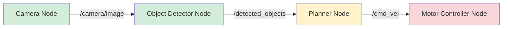

# Chapter 1: ROS 2 Nodes & Architecture

Learn the fundamentals of ROS 2's compute graph by creating and managing nodes, the basic building blocks of any robot application.

---

## Overview

**Learning Outcomes:**
- Explain ROS 2 architecture and the role of nodes in the compute graph
- Create basic ROS 2 nodes using Python and the rclpy API
- Use command-line tools to inspect and debug running nodes
- Understand executors and how they manage callbacks

**Prerequisites:**
- ROS 2 Humble installed (see [Prerequisites](/docs/prerequisites))
- Python 3.10+ proficiency
- Basic understanding of object-oriented programming

**Estimated Time:** 3-4 hours (2 hours reading + 2 hours labs)

**Difficulty:** 🟢 Beginner

---

## Theory & Concepts

### What is a ROS 2 Node?

A **node** is a process that performs computation in your robot system. Think of nodes as individual workers, each responsible for a specific task:

- **Sensor Node**: Reads data from a camera and publishes images
- **Perception Node**: Processes images to detect objects
- **Planning Node**: Decides where the robot should move
- **Control Node**: Sends motor commands to make the robot move

**Key Insight**: ROS 2 applications are built from **many small, specialized nodes** rather than one monolithic program. This modular design makes systems easier to develop, test, and debug.

---

### ROS 2 Compute Graph

The **compute graph** is the network of all running ROS 2 nodes and how they communicate.



**Alt Text**: Flowchart showing ROS 2 nodes communicating via topics: Camera → Object Detector → Planner → Motor Controller

**Caption**: Figure 1.1: Simple ROS 2 compute graph for object detection and navigation

**Real-World Example**: Waymo's self-driving cars use hundreds of ROS 2 nodes running simultaneously—sensor nodes for 29 cameras, perception nodes for object detection, localization nodes for GPS/IMU fusion, and control nodes for steering/braking. This modular architecture allows them to update individual components without rebuilding the entire system.

---

### Node Lifecycle

Every ROS 2 node goes through these stages:

1. **Initialization**: Node starts, registers with ROS 2 middleware
2. **Running**: Node executes callbacks (timers, subscriptions)
3. **Shutdown**: Node cleans up resources and exits

```python
# Simplified node lifecycle
node = Node('my_node')        # 1. Initialize
rclpy.spin(node)              # 2. Run (process callbacks)
node.destroy_node()           # 3. Shutdown
```

---

### Executors: The Callback Scheduler

An **executor** is responsible for calling your node's callbacks (timers, subscriptions, services). Think of it as a task scheduler.

**Single-Threaded Executor** (default):
- Processes one callback at a time
- Simple and predictable
- Use for most applications

**Multi-Threaded Executor** (advanced):
- Processes multiple callbacks concurrently
- Higher throughput but requires thread-safety
- Use for high-performance systems

---

### DDS Middleware

ROS 2 uses **DDS (Data Distribution Service)** as its communication layer. You don't need to understand DDS deeply, but know:

- **Discovery**: Nodes automatically find each other on the network (no master server like ROS 1)
- **Quality of Service (QoS)**: Configure reliability, durability, and other policies
- **Multiple vendors**: Cyclone DDS (default), Fast DDS, RTI Connext

---

## Hands-On Lab: Create Your First Node

### Lab 1.1: Minimal ROS 2 Node

**Objective**: Write a simple node that prints "Hello, ROS 2!" every second.

**Step 1: Create Workspace**

```bash
# Create workspace
mkdir -p ~/ros2_ws/src
cd ~/ros2_ws/src

# Create Python package
ros2 pkg create --build-type ament_python my_robot_package

cd my_robot_package
```

**Step 2: Write the Node**

Create `my_robot_package/hello_node.py`:

```python
#!/usr/bin/env python3
import rclpy
from rclpy.node import Node

class HelloNode(Node):
    def __init__(self):
        super().__init__('hello_node')
        self.get_logger().info('Hello Node has been started!')

        # Create timer that calls timer_callback every 1.0 second
        self.timer = self.create_timer(1.0, self.timer_callback)
        self.counter = 0

    def timer_callback(self):
        self.counter += 1
        self.get_logger().info(f'Hello, ROS 2! (count: {self.counter})')

def main(args=None):
    rclpy.init(args=args)
    node = HelloNode()
    rclpy.spin(node)
    node.destroy_node()
    rclpy.shutdown()

if __name__ == '__main__':
    main()
```

**Step 3: Update package.xml**

Add entry point in `setup.py`:

```python
entry_points={
    'console_scripts': [
        'hello_node = my_robot_package.hello_node:main',
    ],
},
```

**Step 4: Build and Run**

```bash
cd ~/ros2_ws
colcon build --packages-select my_robot_package
source install/setup.bash
ros2 run my_robot_package hello_node
```

**Expected Output:**
```
[INFO] [hello_node]: Hello Node has been started!
[INFO] [hello_node]: Hello, ROS 2! (count: 1)
[INFO] [hello_node]: Hello, ROS 2! (count: 2)
[INFO] [hello_node]: Hello, ROS 2! (count: 3)
...
```

**Success Criteria:**
- ✅ Messages appear every 1 second
- ✅ Counter increments correctly
- ✅ No error messages

---

### Lab 1.2: Node Introspection with CLI Tools

**Objective**: Use ROS 2 command-line tools to inspect running nodes.

**Step 1: Run the Node** (in Terminal 1)

```bash
source ~/ros2_ws/install/setup.bash
ros2 run my_robot_package hello_node
```

**Step 2: Inspect Nodes** (in Terminal 2)

```bash
# List all running nodes
ros2 node list
# Output: /hello_node

# Get detailed info about the node
ros2 node info /hello_node
# Output shows: Publishers, Subscribers, Services, Actions, etc.
```

**Step 3: Remap Node Name**

```bash
# Run node with different name
ros2 run my_robot_package hello_node --ros-args -r __node:=my_custom_name

# Verify new name
ros2 node list
# Output: /my_custom_name
```

**Step 4: Use Namespaces**

```bash
# Run node in a namespace
ros2 run my_robot_package hello_node --ros-args -r __ns:=/robot1

# Verify namespace
ros2 node list
# Output: /robot1/hello_node
```

---

## Code Walkthrough

Let's break down the Hello Node code:

### Importing ROS 2 Libraries

```python
import rclpy
from rclpy.node import Node
```

- `rclpy`: ROS 2 Python client library
- `Node`: Base class for all nodes

---

### Class Definition

```python
class HelloNode(Node):
    def __init__(self):
        super().__init__('hello_node')  # Name of the node
```

**Key Points:**
- Inherit from `Node` class
- Call `super().__init__()` with node name
- Node name must be unique in the compute graph

---

### Creating a Timer

```python
self.timer = self.create_timer(1.0, self.timer_callback)
```

- `1.0`: Timer period in seconds (1 Hz frequency)
- `self.timer_callback`: Function to call every period
- Timer automatically repeats until node shuts down

---

### Logging

```python
self.get_logger().info('Hello, ROS 2!')
```

**Log Levels** (in order of severity):
- `debug()`: Detailed debugging info
- `info()`: Informational messages (default)
- `warn()`: Warnings (potential issues)
- `error()`: Errors (recoverable failures)
- `fatal()`: Fatal errors (unrecoverable)

---

### Main Function

```python
def main(args=None):
    rclpy.init(args=args)         # Initialize ROS 2
    node = HelloNode()            # Create node instance
    rclpy.spin(node)              # Block and process callbacks
    node.destroy_node()           # Cleanup
    rclpy.shutdown()              # Shutdown ROS 2
```

**Critical Points:**
- **ALWAYS** call `rclpy.init()` before creating nodes
- **ALWAYS** call `rclpy.shutdown()` before exiting
- `rclpy.spin()` blocks until Ctrl+C (keeps node running)

---

## Common ROS 2 Commands

### Node Management

```bash
# List all running nodes
ros2 node list

# Get info about a specific node
ros2 node info /node_name

# Kill all nodes (clean shutdown)
pkill -SIGINT -f ros
```

### Debugging

```bash
# Check if ROS 2 is sourced
echo $ROS_DISTRO
# Should output: humble

# Verify Python node can be found
ros2 pkg executables my_robot_package
# Should list: hello_node

# Run with verbose logging
ros2 run my_robot_package hello_node --ros-args --log-level debug
```

---

## Quiz & Self-Assessment

### Multiple Choice Questions

**Question 1**: What is a ROS 2 node?

A. A topic for data transfer
B. A process that performs computation
C. A configuration file
D. A message type

<details>
<summary>Show Answer</summary>

**Correct Answer**: B

**Explanation**: A node is an independent process in the ROS 2 compute graph. Topics (A) are for communication between nodes. Configuration files (C) and message types (D) are not nodes.

</details>

---

**Question 2**: Which command lists all running ROS 2 nodes?

A. `ros2 list nodes`
B. `ros2 node show`
C. `ros2 node list`
D. `ros2 show nodes`

<details>
<summary>Show Answer</summary>

**Correct Answer**: C

**Explanation**: `ros2 node list` displays all active nodes in the compute graph.

</details>

---

**Question 3**: What does `rclpy.spin()` do?

A. Starts the node
B. Blocks and processes callbacks until shutdown
C. Rotates the robot
D. Publishes messages

<details>
<summary>Show Answer</summary>

**Correct Answer**: B

**Explanation**: `rclpy.spin()` keeps the node running and processes callbacks (timers, subscriptions, etc.) until Ctrl+C or `rclpy.shutdown()`.

</details>

---

**Question 4**: What is the default executor type in ROS 2?

A. Multi-threaded
B. Real-time
C. Single-threaded
D. Distributed

<details>
<summary>Show Answer</summary>

**Correct Answer**: C

**Explanation**: The default executor is single-threaded, processing one callback at a time. Multi-threaded executors are available for advanced use cases.

</details>

---

**Question 5**: What happens if two nodes have the same name?

A. Both nodes run normally
B. The second node fails to start
C. ROS 2 renames one automatically
D. They merge into one node

<details>
<summary>Show Answer</summary>

**Correct Answer**: B

**Explanation**: Node names must be unique. If a duplicate name is detected, the second node will fail during initialization.

</details>

---

### Coding Challenge

**Challenge**: Modify the Hello Node to:
1. Accept a parameter `frequency` (default: 1.0 Hz)
2. Print "Hello from [node_name]" using the actual node name
3. Stop after 10 messages

**Hints:**
- Use `self.declare_parameter()` for parameters
- Use `self.get_name()` to get node name
- Add a counter and call `rclpy.shutdown()` when done

<details>
<summary>Show Solution</summary>

```python
#!/usr/bin/env python3
import rclpy
from rclpy.node import Node

class ParameterizedHelloNode(Node):
    def __init__(self):
        super().__init__('parameterized_hello_node')

        # Declare parameter with default value
        self.declare_parameter('frequency', 1.0)
        freq = self.get_parameter('frequency').value

        self.get_logger().info(f'Starting with frequency: {freq} Hz')

        # Create timer with parameterized frequency
        self.timer = self.create_timer(1.0 / freq, self.timer_callback)
        self.counter = 0
        self.max_count = 10

    def timer_callback(self):
        self.counter += 1
        node_name = self.get_name()
        self.get_logger().info(f'Hello from {node_name} (count: {self.counter})')

        if self.counter >= self.max_count:
            self.get_logger().info('Reached max count, shutting down')
            rclpy.shutdown()

def main(args=None):
    rclpy.init(args=args)
    node = ParameterizedHelloNode()
    rclpy.spin(node)
    node.destroy_node()
    rclpy.shutdown()

if __name__ == '__main__':
    main()
```

**Run with custom frequency:**
```bash
ros2 run my_robot_package parameterized_hello_node --ros-args -p frequency:=2.0
```

</details>

---

## Troubleshooting

| Issue | Cause | Solution |
|-------|-------|----------|
| `ros2: command not found` | ROS 2 not sourced | Run `source /opt/ros/humble/setup.bash` |
| Node not showing in `ros2 node list` | Build error or not running | Check `colcon build` output for errors |
| `ModuleNotFoundError: No module named 'rclpy'` | Wrong Python version or environment | Use Python 3.10+, source workspace |
| Timer not firing | Forgot to call `rclpy.spin()` | Add `rclpy.spin(node)` in main() |

---

## Further Reading

### Official Documentation
- [ROS 2 Nodes Concept](https://docs.ros.org/en/humble/Concepts/About-ROS-2-Nodes.html)
- [rclpy API Reference](https://docs.ros.org/en/humble/p/rclpy/)
- [Executors in ROS 2](https://docs.ros.org/en/humble/Concepts/About-Executors.html)

### Video Tutorials
- [Articulated Robotics: Understanding ROS 2 Nodes](https://www.youtube.com/watch?v=Gg25GfA456o)

---

## Summary

You've learned:
- ✅ ROS 2 nodes are independent processes in the compute graph
- ✅ Nodes communicate via topics, services, and actions (next chapter)
- ✅ Executors manage callback execution
- ✅ CLI tools (`ros2 node list`, `ros2 node info`) for debugging
- ✅ How to create a basic node with `rclpy`

**Next Chapter**: [Topics, Services & Actions](/docs/module-ros2/topics-services) →

---

**Chapter Version**: 1.0.0
**Last Updated**: December 2025
**Estimated Completion Time**: 3-4 hours
