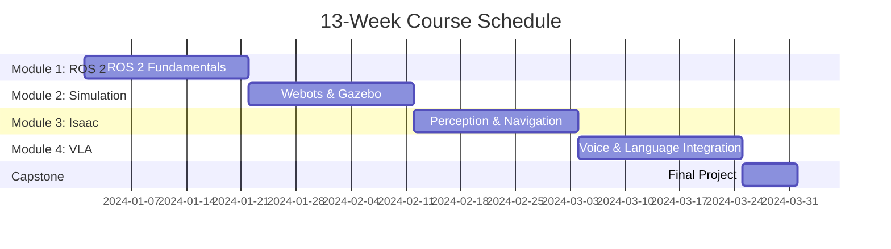

# 13-Week Curriculum Overview

This page maps the entire Physical AI & Humanoid Robotics curriculum to a **13-week learning schedule** with 8-12 hours per week (SC-003 requirement).

---

## Curriculum Structure

**Alt Text**: Gantt chart showing 13-week schedule with four modules (ROS 2, Simulation, Isaac, VLA) each taking 3 weeks, followed by 1-week capstone project.

**Caption**: Figure: Course timeline breakdown across 13 weeks

---

## Weekly Schedule

### Weeks 1-3: Module 1 - ROS 2 Fundamentals

---

## Week 1: ROS 2 Architecture & Nodes

**Learning Objectives:**
- Understand ROS 2 architecture (nodes, executors, middleware)
- Create basic ROS 2 nodes in Python
- Debug ROS 2 applications using CLI tools

**Topics Covered:**
- ROS 2 vs ROS 1 (key differences)
- Node lifecycle and executors
- Command-line tools (`ros2 node`, `ros2 topic`, `ros2 service`)
- Creating a ROS 2 workspace with colcon

**Readings:**
- Introduction to ROS 2
- ROS 2 Nodes chapter
- URDF Basics (preview)

**Hands-On Labs:**
- **Lab 1.1**: Install ROS 2 Humble and create workspace
- **Lab 1.2**: Write your first ROS 2 node (hello world)
- **Lab 1.3**: Use `ros2 topic list` and `ros2 node info` for debugging

**Code Examples:**
- `01_basic_node.py`: Minimal ROS 2 node
- `02_timer_node.py`: Node with periodic callbacks

**Deliverables:**
- Working ROS 2 workspace on your machine
- Screenshot of `ros2 node list` showing your custom node
- Answers to Week 1 self-check questions

**Estimated Hours:** 10 hours
- Reading: 2 hours
- Labs: 6 hours
- Quiz/review: 2 hours

---

## Week 2: ROS 2 Communication Patterns

**Learning Objectives:**
- Implement publisher/subscriber pattern for data streaming
- Create service clients and servers for request/response
- Use actions for long-running tasks with feedback

**Topics Covered:**
- Topics (publish/subscribe)
- Services (request/response)
- Actions (goal/feedback/result)
- Quality of Service (QoS) policies

**Readings:**
- ROS 2 Topics, Services & Actions chapter
- Message types (std_msgs, geometry_msgs)
- QoS profiles (reliability, durability)

**Hands-On Labs:**
- **Lab 2.1**: Create publisher/subscriber pair for sensor data
- **Lab 2.2**: Implement service for robot configuration
- **Lab 2.3**: Build action server for navigation goals

**Code Examples:**
- `03_pubsub.py`: Publisher and subscriber nodes
- `04_service.py`: Service client and server
- `05_action_server.py`: Action server for long tasks

**Deliverables:**
- ROS 2 package with publisher, subscriber, service, and action
- Video demo showing message passing between nodes
- Completed Week 2 quiz (5+ questions)

**Estimated Hours:** 11 hours
- Reading: 2 hours
- Labs: 7 hours
- Quiz/assessment: 2 hours

---

## Week 3: URDF & Robot Navigation

**Learning Objectives:**
- Create URDF robot descriptions with links and joints
- Visualize robots in RViz
- Use Nav2 stack for autonomous navigation

**Topics Covered:**
- URDF syntax (links, joints, sensors)
- TF2 (coordinate frame transformations)
- Nav2 stack overview
- Path planning with Dijkstra/A*

**Readings:**
- URDF chapter
- Robot State Publisher
- Nav2 stack documentation

**Hands-On Labs:**
- **Lab 3.1**: Write URDF for a mobile robot (differential drive)
- **Lab 3.2**: Add sensors (camera, LiDAR) to URDF
- **Lab 3.3**: Set up Nav2 for autonomous navigation in simulation

**Code Examples:**
- `robot.urdf`: Example robot description
- `nav2_params.yaml`: Navigation configuration

**Deliverables:**
- Valid URDF file that loads in RViz without errors
- Robot navigating to waypoints in Gazebo
- Module 1 project completion (autonomous mobile robot)

**Estimated Hours:** 12 hours
- Reading: 3 hours
- Labs: 7 hours
- Module project: 2 hours

**Module 1 Checkpoint**: ✅ Can create ROS 2 packages, implement communication patterns, and build navigation-capable robots

---

### Weeks 4-6: Module 2 - Simulation Environments

---

## Week 4: Webots Simulation

**Learning Objectives:**
- Set up Webots simulation environment
- Create custom worlds with obstacles and terrain
- Integrate Webots with ROS 2

**Topics Covered:**
- Webots architecture (supervisor, robot nodes)
- World file format (.wbt)
- Sensor simulation (cameras, distance sensors)
- Physics engine configuration

**Readings:**
- Webots overview chapter
- Simulation vs reality (sim-to-real gap)
- Sensor noise models

**Hands-On Labs:**
- **Lab 4.1**: Install Webots and run example robots
- **Lab 4.2**: Create custom warehouse world
- **Lab 4.3**: Add RGB-D camera to robot and visualize in RViz

**Code Examples:**
- `warehouse.wbt`: Webots world file
- `webots_ros2_driver.py`: ROS 2 interface for Webots

**Deliverables:**
- Custom Webots world with 10+ environmental features
- Screenshot of robot camera feed in RViz
- Week 4 self-check quiz

**Estimated Hours:** 10 hours
- Reading: 2 hours
- Labs: 6 hours
- Quiz: 2 hours

---

## Week 5: Gazebo Simulation

**Learning Objectives:**
- Compare Gazebo Classic vs Gazebo Sim (Ignition)
- Build complex worlds with SDF format
- Simulate contact physics for manipulation

**Topics Covered:**
- SDF (Simulation Description Format)
- Gazebo plugins for sensors and actuators
- Contact simulation and friction models
- Multi-robot scenarios

**Readings:**
- Gazebo Sim chapter
- SDF specification
- Physics engines (ODE, Bullet, DART)

**Hands-On Labs:**
- **Lab 5.1**: Create Gazebo world with dynamic objects
- **Lab 5.2**: Simulate LiDAR and visualize point clouds
- **Lab 5.3**: Implement object grasping with contact simulation

**Code Examples:**
- `office.sdf`: Gazebo world file
- `gazebo_ros2_control.yaml`: Controller configuration

**Deliverables:**
- Gazebo world with physics-based grasping
- LiDAR point cloud visualization in RViz
- Comparison report: Webots vs Gazebo (1 page)

**Estimated Hours:** 11 hours
- Reading: 2 hours
- Labs: 7 hours
- Report: 2 hours

---

## Week 6: Manipulation & Sensor Simulation

**Learning Objectives:**
- Simulate robot arms and grippers
- Validate simulation fidelity with real-world data
- Optimize simulation performance

**Topics Covered:**
- MoveIt 2 for motion planning
- Gripper simulation (parallel jaw, multi-finger)
- Sensor noise calibration
- Real-time factor optimization

**Readings:**
- MoveIt 2 chapter
- Sim-to-real transfer techniques
- Performance profiling for simulations

**Hands-On Labs:**
- **Lab 6.1**: Set up MoveIt 2 for robot arm
- **Lab 6.2**: Simulate pick-and-place task
- **Lab 6.3**: Compare simulated sensor data to reference dataset

**Code Examples:**
- `moveit_config/`: MoveIt 2 configuration package
- `grasp_planner.py`: Object grasping pipeline

**Deliverables:**
- Robot arm picking and placing objects in simulation
- Video demo of pick-and-place sequence
- Module 2 project: Warehouse automation with mobile manipulator

**Estimated Hours:** 12 hours
- Reading: 3 hours
- Labs: 7 hours
- Module project: 2 hours

**Module 2 Checkpoint**: ✅ Can create simulation environments, simulate sensors and actuators, implement manipulation tasks

---

### Weeks 7-9: Module 3 - NVIDIA Isaac

---

## Week 7: Isaac Sim Setup & vSLAM

**Learning Objectives:**
- Install and configure NVIDIA Isaac Sim
- Implement Visual SLAM for localization
- Generate occupancy grid maps

**Topics Covered:**
- Isaac Sim architecture (Omniverse, RTX ray tracing)
- Isaac ROS packages
- Visual SLAM algorithms (ORB-SLAM, VINS-Fusion)
- Map representation (occupancy grids, point clouds)

**Readings:**
- NVIDIA Isaac overview chapter
- Visual SLAM theory
- Isaac ROS Visual SLAM package

**Hands-On Labs:**
- **Lab 7.1**: Install Isaac Sim and spawn TIAGo robot
- **Lab 7.2**: Configure Isaac ROS Visual SLAM
- **Lab 7.3**: Generate map by teleoprating robot through environment

**Code Examples:**
- `isaac_sim_launch.py`: Isaac Sim startup script
- `vslam_config.yaml`: Visual SLAM parameters

**Deliverables:**
- Screenshot of Isaac Sim with humanoid robot
- Generated occupancy grid map (saved as image)
- Week 7 quiz on SLAM concepts

**Estimated Hours:** 10 hours
- Reading: 3 hours (Isaac setup is complex)
- Labs: 6 hours
- Quiz: 1 hour

---

## Week 8: Object Detection & Perception

**Learning Objectives:**
- Integrate YOLO for object detection
- Use DOPE for 6D pose estimation
- Build perception pipeline with Isaac ROS

**Topics Covered:**
- YOLO v8 architecture
- DOPE (Deep Object Pose Estimation)
- Isaac ROS GEMs (reusable perception modules)
- TensorRT optimization

**Readings:**
- Object detection chapter
- Isaac ROS perception packages
- TensorRT conversion workflow

**Hands-On Labs:**
- **Lab 8.1**: Run YOLO object detection on Isaac Sim camera feed
- **Lab 8.2**: Estimate 6D pose of objects with DOPE
- **Lab 8.3**: Optimize model with TensorRT (benchmark FPS improvement)

**Code Examples:**
- `yolo_detector.py`: YOLO inference with Isaac ROS
- `dope_pose_estimator.py`: 6D pose estimation
- `tensorrt_convert.sh`: Model optimization script

**Deliverables:**
- Annotated images showing detected objects with bounding boxes
- Performance comparison: PyTorch vs TensorRT (table with FPS)
- Week 8 self-assessment

**Estimated Hours:** 11 hours
- Reading: 2 hours
- Labs: 7 hours
- Benchmarking: 2 hours

---

## Week 9: Autonomous Navigation in Isaac

**Learning Objectives:**
- Combine perception, planning, and control in Isaac Sim
- Navigate cluttered environments with dynamic obstacles
- Debug complex perception-control pipelines

**Topics Covered:**
- Nav2 integration with Isaac Sim
- Obstacle avoidance with cost maps
- Multi-sensor fusion (LiDAR + camera)
- Failure recovery behaviors

**Readings:**
- Isaac navigation chapter
- Sensor fusion techniques
- Debugging distributed ROS 2 systems

**Hands-On Labs:**
- **Lab 9.1**: Set up Nav2 with Isaac Sim
- **Lab 9.2**: Navigate robot in cluttered warehouse
- **Lab 9.3**: Handle dynamic obstacles (moving carts)

**Code Examples:**
- `isaac_nav2_params.yaml`: Navigation configuration for Isaac
- `costmap_config.yaml`: Multi-sensor cost map fusion

**Deliverables:**
- Video of robot navigating around obstacles
- Debug log showing problem-solving approach
- Module 3 project: Autonomous navigation + object detection

**Estimated Hours:** 12 hours
- Reading: 2 hours
- Labs: 8 hours
- Module project: 2 hours

**Module 3 Checkpoint**: ✅ Can use Isaac Sim for perception, implement SLAM, optimize neural networks, build autonomous systems

---

### Weeks 10-12: Module 4 - Vision-Language-Action

---

## Week 10: Speech Recognition & Language Models

**Learning Objectives:**
- Integrate Whisper for speech-to-text
- Use LLMs (GPT-4, Llama) for task planning
- Ground natural language to robot concepts

**Topics Covered:**
- Whisper architecture (transformer-based ASR)
- Large Language Models for robotics
- Prompt engineering for robot tasks
- Grounding language to action spaces

**Readings:**
- VLA systems overview chapter
- Whisper model documentation
- LLM prompting for robotics

**Hands-On Labs:**
- **Lab 10.1**: Set up Whisper for real-time speech recognition
- **Lab 10.2**: Use GPT-4 API for task decomposition
- **Lab 10.3**: Map text commands to robot action primitives

**Code Examples:**
- `whisper_listener.py`: Speech-to-text node
- `llm_planner.py`: LLM-based task planning
- `action_grounding.json`: Text-to-action mapping

**Deliverables:**
- Voice command interface accepting 5+ commands
- LLM-generated action sequence (JSON output)
- Week 10 quiz on VLA concepts

**Estimated Hours:** 10 hours
- Reading: 3 hours
- Labs: 6 hours
- Quiz: 1 hour

---

## Week 11: Action Primitives & Execution

**Learning Objectives:**
- Define robot action primitives (navigate, grasp, place)
- Execute LLM-generated plans on robot
- Handle execution failures gracefully

**Topics Covered:**
- Behavior Trees for task execution
- Action primitive library design
- Error handling and replanning
- Sim-to-real considerations

**Readings:**
- Action execution chapter
- Behavior Trees in robotics
- Failure recovery strategies

**Hands-On Labs:**
- **Lab 11.1**: Implement action primitives (navigate, pick, place)
- **Lab 11.2**: Execute multi-step plans from LLM
- **Lab 11.3**: Add error handling (what if object not found?)

**Code Examples:**
- `action_primitives.py`: Navigate, grasp, place functions
- `behavior_tree.xml`: Task execution logic
- `error_handler.py`: Replanning on failure

**Deliverables:**
- Execution trace showing LLM plan → robot actions
- Video of robot completing 3-step task (e.g., "get red box from shelf")
- Week 11 self-check

**Estimated Hours:** 11 hours
- Reading: 2 hours
- Labs: 7 hours
- Debugging: 2 hours

---

## Week 12: End-to-End VLA System

**Learning Objectives:**
- Build complete voice-controlled robot system
- Test with diverse natural language commands
- Evaluate system performance and iterate

**Topics Covered:**
- System integration patterns
- Testing VLA systems
- Performance metrics (success rate, latency)
- User study design

**Readings:**
- VLA integration chapter
- Testing methodologies for AI robotics
- Metrics for embodied AI

**Hands-On Labs:**
- **Lab 12.1**: Integrate voice → LLM → actions → execution
- **Lab 12.2**: Test with 10 diverse commands
- **Lab 12.3**: Measure success rate and latency

**Code Examples:**
- `vla_system.py`: End-to-end integration
- `test_suite.py`: Automated testing script
- `metrics_logger.py`: Performance tracking

**Deliverables:**
- Working VLA system (voice → robot action)
- Test results table (10 commands, success/failure)
- Module 4 project: Voice-controlled pick-and-place

**Estimated Hours:** 12 hours
- Reading: 2 hours
- Labs: 8 hours
- Module project: 2 hours

**Module 4 Checkpoint**: ✅ Can integrate LLMs with robots, build voice interfaces, execute natural language commands

---

### Week 13: Capstone Project

---

## Week 13: Voice-Controlled Humanoid Robot

**Learning Objectives:**
- Synthesize all modules into cohesive system
- Debug complex multi-component systems
- Communicate technical implementation

**Project Requirements:**
1. Accept natural language voice commands (Whisper)
2. Use LLM to plan multi-step action sequences (GPT-4/Llama)
3. Navigate environment with Visual SLAM (Isaac ROS)
4. Detect and grasp objects (YOLO + MoveIt)
5. Execute tasks in Isaac Sim or Gazebo

**Example Commands:**
- "Find the red box and move it to the table"
- "Navigate to the kitchen and pick up the mug"
- "Clean up the workspace by stacking all blocks"

**Deliverables:**
1. **Code Repository**: GitHub repo with all source code
2. **Demo Video**: 3-5 minute video showing system working (upload to YouTube/Loom)
3. **Documentation**: README with:
   - System architecture diagram
   - Setup instructions
   - Usage examples
   - Known limitations
4. **Presentation**: 5-minute presentation explaining implementation (optional)

**Assessment Rubric:**
| Criterion | Points | Description |
|-----------|--------|-------------|
| **Voice Processing** | 20 | Whisper integration, command recognition accuracy |
| **Task Planning** | 20 | LLM generates valid action sequences |
| **Navigation** | 25 | Robot navigates to targets without collisions |
| **Manipulation** | 30 | Object detection and grasping success |
| **Code Quality** | 5 | Clean code, comments, error handling |
| **Total** | **100** | |

**Estimated Hours:** 12 hours
- System integration: 6 hours
- Testing and debugging: 4 hours
- Documentation and video: 2 hours

**Capstone Checkpoint**: ✅ Complete Physical AI system demonstrating all learned skills

---

## Total Time Commitment

| Module | Weeks | Hours/Week | Total Hours |
|--------|-------|------------|-------------|
| Module 1: ROS 2 | 3 | 10-12 | 33 hours |
| Module 2: Simulation | 3 | 10-12 | 33 hours |
| Module 3: Isaac | 3 | 10-12 | 33 hours |
| Module 4: VLA | 3 | 10-12 | 33 hours |
| Capstone | 1 | 12 | 12 hours |
| **Total** | **13** | **8-12 avg** | **144 hours** |

**Meets SC-003**: ✅ 13 weeks at 8-12 hours/week

---

## Flexibility and Customization

### Accelerated Path (9 weeks)

Skip or condense modules based on prior knowledge:
- **Have ROS 2 experience?** Skip Module 1, start at Module 2 (save 3 weeks)
- **Know simulation already?** Skip Module 2, go directly to Isaac (save 3 weeks)
- **No NVIDIA GPU?** Skip Module 3, do Modules 1, 2, 4 + simplified capstone (9 weeks total)

### Extended Path (20 weeks)

Take more time for deeper learning:
- Add buffer week after each module for review (16 weeks)
- Split weeks into 6 hours/week instead of 12 (26 weeks)
- Include optional "deep dive" chapters (20-24 weeks)

### Module-Specific Focus

Only need specific skills?
- **ROS 2 only**: Complete Module 1 (3 weeks)
- **Simulation specialist**: Modules 1-2 (6 weeks)
- **AI integration**: Modules 1 + 4 (6 weeks)

---

## Week-by-Week Study Tips

### Week Planning Template

**Monday-Tuesday (4 hours):**
- Read chapter content
- Watch related videos/demos
- Take notes on key concepts

**Wednesday-Thursday (5 hours):**
- Complete hands-on labs
- Debug issues as they arise
- Ask questions on forums

**Friday-Saturday (3 hours):**
- Finish lab deliverables
- Take quiz/self-assessment
- Review weak areas

**Sunday:**
- Rest or optional deep dive on interesting topics

---

## Success Metrics

You're on track if:
- [ ] Completing labs within estimated time (±2 hours)
- [ ] Scoring 70%+ on weekly quizzes
- [ ] Code runs without errors (or you can debug issues)
- [ ] Understanding concepts well enough to explain to others

You might be falling behind if:
- Labs taking 2x estimated time (need to review prerequisites)
- Quiz scores below 60% (revisit chapter content)
- Unable to debug errors (post on forums for help)

---

## Community and Support

**Weekly Office Hours** (optional):
- Join ROS Discourse for Q&A
- Post your progress on LinkedIn/Twitter with #PhysicalAI
- Form study groups with other learners

**Milestone Celebrations**:
- Week 3: Share your first ROS 2 robot video
- Week 6: Post your simulation demo
- Week 9: Share Isaac Sim navigation video
- Week 13: Present capstone project

---

## Next Steps

**Ready to start Week 1?** → [Module 1: ROS 2 Overview](/docs/module-ros2/overview)

**Want to customize your path?** → Review module prerequisites in each module overview

**Questions about time commitment?** → See [Prerequisites](/docs/prerequisites) for time management tips

---

**Last Updated**: December 2025
**Curriculum Version**: 1.0.0
**License**: CC-BY-4.0
